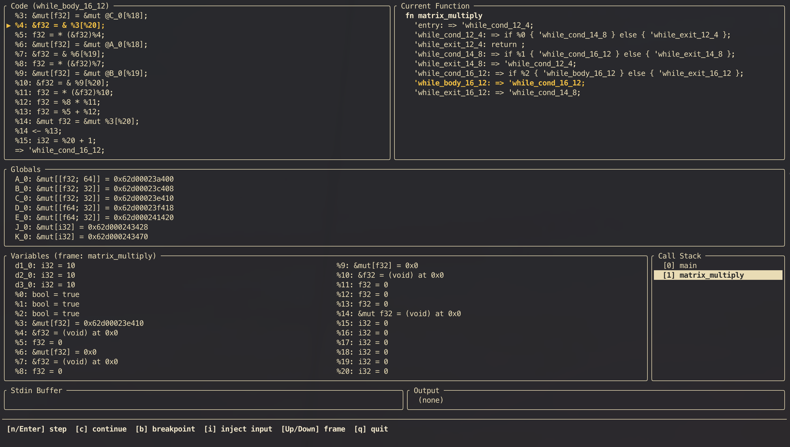

# Code of Compiler Lab of UCAS, 2026

Build:

```
cmake -Bbuild -DCMAKE_BUILD_TYPE=Release
cmake --build build
```

ANTLR generation is integrated into CMake. As long as Java is available and
`deps/antlr-4.13.1-complete.jar` exists, parser sources are generated automatically
during the build.

Test:

```
bash scripts/test_all.sh
```

Usage:

<!--usage-->
```
compiler [args]... files ...

    --help                  Show this help message

    -o, --output <file>     Write the generated IR or assembly to the specified file (implies --silent)
    --silent                Suppress all compiler output except the return value when executing

    --ast                   Print the AST of the input files
    --ast-info              Print the semantic analysis result of the AST

    --ir                    Print the generated IR
    --ir-info               Print analysis result of the generated IR

    --retain-ssa-value      Do not convert SSAValue to TempValue in IR optimization passes

    --optimize-copy         Apply Copy Propagation optimization
    --optimize-const        Apply Constant Folding optimization
    --optimize-def          Apply Dead Definition Elimination optimization
    --optimize-alloc        Apply Dead Allocation Elimination optimization
    --optimize-temp         Apply Dead Temporary Value Elimination optimization
    --optimize-block        Apply Dead/Trivial Block Elimination optimization
    --optimize-inline [N=8] Apply Function Call Inlining optimization (threshold: N insts)
    --optimize-exp          Apply Common Subexpression Elimination optimization
    -O1                     Apply all above optimizations
    --optimize-lowering     Apply optimizations after lowering transformations
    --optimize-assembly     Apply optimizations after assembly code generation
    -O2, --optimize         Apply all above optimizations

    --no-optimize-[name]    Disable specific optimization when -O1/-O2/--optimize is enabled

    --lowering-addr         Apply array-index lowering
    --lowering-proxy        Apply access proxy insertion (create temp value proxy which is reg-allocatable)
    --lowering-array        Apply array initialization lowering (lower array store to memset/memcpy)
    --lowering-reg          Apply register allocation
    --lowering-prune        Apply redundant move elimination after register allocation
    -L, --lowering          Apply above lowering transformations and generate RV64 assembly code

    --exec                  Execute the generated IR
    --exec-debug            Enable debug mode in execution (add breakpoints, execute step by step, etc.)
    --exec-trace            Trace execution with detailed instruction and block information

    -S, --asm               Print the generated RV64 assembly code (implies --lowering)
    --asm-exec              Execute the generated assembly code (implies --lowering)

interpreter [--help] [--silent] [--print] IR-file
    --help      Show this help message
    --print     Show reconstructed IR, without executing
    --silent    Suppress all interpreter output except the return value when executing
```
<!--/usage-->

Examples:

1. print/output
    - print AST: `compiler --ast source.cact`
    - print IR: `compiler --ir source.cact`
    - print optimized IR: `compiler --ir --optimize source.cact`
    - output IR to file: `compiler --ir source.cact -o ir_code.riir`
    - print Assembly: `compiler -S source.cact`
    - output Assembly code to file: `compiler -S source.cact -o asm_code.s`
    - optimize: `-O0/-O1/-O2`

> [!NOTE]
> When applied transformations on IR, the intermediate IR would be put into stdout (can be suppressed by --silent), only final IR would be output into file.

2. interpret source program (by compiler)
    - at IR stage: `compiler --exec source.cact`
    - at IR stage, sliently (without any output except program IO and return code): `compiler --exec --silent source.cact`
    - at Assembly stage: `compiler --asm-exec source.cact` (also optional `--silent`)

> [!NOTE]
> The optimizations and lowering transformations would be applied before IR/Assembly executing.

3. interpret IR program (by interpreter)
    - `interpreter ir_code.riir` (also optional `--silent`)

4. debug
    - print AST info (type, def loc, ...): `--ast-info`
    - print IR info (dominance, liveness, ...): `--ir-info`
    - execute IR with trace/debug: `--exec-trace` or `--exec-debug`

---

Debug TUI (launch by `--exec --exec-debug`)



---

Design Notes:

- [Comprehensive Note of IR](docs/reports/p2.pdf)

- [Other Notes](docs/)

Pipeline:

```
source(c) -> IR(RIIR) -> Construct SSA -> optimize... -> Destruct SSA -> target(rv64)
```

---

<!--source_tree-->
```
src/
├── backend/
│   ├── esir/
│   ├── ir/
│   │   ├── alloc.cpp
│   │   ├── analysis/
│   │   │   ├── cfg.hpp:	Control Flow Graph
│   │   │   ├── dataflow/
│   │   │   │   ├── dominance.hpp
│   │   │   │   ├── framework.hpp:	Unified Data Flow Equation Solver
│   │   │   │   └── liveness.hpp:	Live Variable Analysis
│   │   │   ├── dominance.hpp
│   │   │   ├── usedef.cpp
│   │   │   ├── usedef.h
│   │   │   └── utils.hpp
│   │   ├── block.cpp
│   │   ├── func.cpp
│   │   ├── gen/
│   │   │   ├── decl.cpp
│   │   │   ├── expr.cpp
│   │   │   ├── irgen.h
│   │   │   └── stmt.cpp
│   │   ├── inst.cpp
│   │   ├── ir.h
│   │   ├── lowering/
│   │   │   ├── abi.hpp
│   │   │   ├── addr.hpp
│   │   │   ├── array.hpp
│   │   │   ├── proxy.hpp
│   │   │   ├── reg2mem.hpp
│   │   │   ├── regalloc/
│   │   │   │   ├── colorize.hpp:	Chaitin-Briggs Graph Coloring Register Allocator
│   │   │   │   ├── graph.hpp
│   │   │   │   ├── main.hpp
│   │   │   │   ├── precolorize.hpp
│   │   │   │   └── spill.hpp
│   │   │   └── stdlib.hpp
│   │   ├── op.hpp
│   │   ├── parse/
│   │   │   └── visit.hpp
│   │   ├── program.cpp
│   │   ├── transform/
│   │   │   ├── framework.hpp
│   │   │   ├── optim/
│   │   │   │   ├── common_expr.hpp:	Common Subexpressions Elimination, requires SSA
│   │   │   │   ├── constant_fold.hpp:	Const Propagation Pass, requires SSA
│   │   │   │   ├── copy_propagation.hpp:	Copy Propagation Pass, requires SSA
│   │   │   │   ├── dead_alloc.hpp:	Dead Allocation Elimination Pass
│   │   │   │   ├── dead_block.hpp:	CFG Simplification & Dead Block Elimination Pass
│   │   │   │   ├── dead_def.hpp:	Dead Definition Elimination Pass, requires SSA
│   │   │   │   └── inline.hpp:	Inline Pass, requires SSA
│   │   │   └── ssa/
│   │   │       ├── construct.hpp:	SSA Construct Pass
│   │   │       └── destruct.hpp:	Exit from SSA Form by eliminating phi instructions
│   │   ├── type.hpp:	algebraic data types for IR
│   │   ├── value.cpp
│   │   └── vm/
│   │       ├── assign.cpp
│   │       ├── debug.cpp
│   │       ├── exec.cpp
│   │       ├── view.hpp
│   │       └── vm.h
│   └── rv64/
│       ├── abi.hpp
│       ├── emit.cpp
│       ├── inst.hpp
│       ├── isel.hpp
│       ├── op.hpp
│       ├── optim/
│       │   ├── framework.hpp
│       │   ├── label.hpp
│       │   └── peephole.hpp
│       └── vm/
│           ├── exec.cpp
│           └── vm.hpp
├── compiler.cpp
├── frontend/
│   ├── ast/
│   │   ├── analysis/
│   │   │   ├── decl.cpp
│   │   │   ├── expr.cpp
│   │   │   ├── func.cpp
│   │   │   ├── scope.cpp
│   │   │   ├── semantic_ast.h
│   │   │   ├── stmt.cpp
│   │   │   └── type.cpp
│   │   ├── ast.hpp
│   │   └── op.hpp
│   └── syntax/
│       ├── error.hpp
│       └── visit.hpp
├── interpreter.cpp
├── tests/
│   ├── test_adt.cpp
│   ├── test_ast.cpp
│   ├── test_dessa_phi.cpp
│   ├── test_dessa_split.cpp
│   ├── test_dominance.cpp
│   ├── test_ir_parse.cpp
│   ├── test_ir_parse_all.cpp
│   ├── test_liveness.cpp
│   ├── test_liveness_all.cpp
│   ├── test_optimize.cpp
│   ├── test_reg2mem.cpp
│   ├── test_regalloc.cpp
│   ├── test_regalloc_interfere.cpp
│   ├── test_regalloc_inversion.cpp
│   ├── test_regalloc_inversion_example.cpp
│   ├── test_regalloc_inversion_simplify.cpp
│   ├── test_regalloc_precolorize.cpp
│   ├── test_regalloc_ra.cpp
│   ├── test_sem.cpp
│   ├── test_serialize.cpp
│   ├── test_spill.cpp
│   ├── test_ssa.cpp
│   └── test_vm.cpp
└── utils/
    ├── diagnosis.hpp
    ├── match.hpp
    ├── serialize.hpp
    ├── traits.hpp
    └── tui.h

22 directories, 99 files
```
<!--/source_tree-->

---

IR Type System:

```rust
enum PrimitiveType {
    Int1,
    Int32,
    Int,
    Float32,
    Float64,
    Float,
}
enum Type {
    Top,
    Bottom,
    Sum(Vec<Type>),
    Product(Vec<Type>),
    Func(Product, Box<Type>),
    Array(Box<Type>, usize),
    Reference(Box<Type>, bool, bool),
    Primitive(PrimitiveType),
}
```

---

AST:

```rust
enum ConstExp {
    Int(i32),
    Float(f32),
    Double(f64),
    Bool(bool),
}
enum LValExp {
    Name(String),
    WithIndex(Exp),
}
enum PrimaryExp {
    Box(Box<Exp>),
    LVal(LValExp),
    Const(ConstExp),
}
enum Exp {
    Const(ConstExp),
    Primary(PrimaryExp),
    Unary(UnaryOp, Box<Exp>),
    Binary(BinaryOp, Box<Exp>, Box<Exp>),
    Call(LVal, Vec<<Exp>),
}
enum Stmt {
    Exp(Exp),
    Assign(LValExp, Exp),
    If(Exp, Box<Stmt>),
    While(Exp, Box<Stmt>),
    Return(Option<Exp>),
    Break,
    Continue,
    Block(Vec<BlockItem>),
}
enum Decl {
    Const(ConstDecl),
    Var(VarDecl),
}
enum BlockItem {
    Decl(Decl),
    Stmt(Stmt),
}
enum ConstInitVal {
    Exp(ConstExp),
    Array(Vec<ConstInitVal>),
}
struct ConstDef(String, Vec<Option<usize>>, ConstInitVal)
struct VarDef(String, Vec<Option<usize>>, Option<ConstInitVal>)
struct ConstDecl(Type, Vec<ConstDef>)
struct VarDecl(Type, Vec<VarDef>)
struct FuncParam(Type, String, Vec<Option<usize>>)
struct FuncDef(Type, String, Vec<FuncParam>, Stmt)
enum CompUnitItem {
    Decl(Decl),
    Func(FuncDef),
}
struct CompUnit(Vec<CompUnitItem>)
```

---

IR:

```rust
enum LeftValue {
    Named(Type, &Alloc),
    Temp(Type, &Func, usize),
    Ssa(Type, &Alloc, usize),
}
enum Value {
    Left(LeftValue),
    Const(Type, ConstExp),
}
enum Inst {
    Unary(UnaryOp, Option<LeftValue>, Value),
    Binary(BinaryOp, Option<LeftValue>, Value, Value),
    Call(Option<LeftValue>, Value, Vec<Value>),
    Phi(Option<LeftValue>, Vec<&Block, Value>)
}
enum Exit {
    Return(Value),
    Branch(Value, &Block, &Block),
    Jump(&Block),
}
struct Block(String, Vec<Inst>, Exit)
struct Alloc(Value, Option<Value>)
struct Func(Type, String, Vec<(Type, String)>, Vec<Alloc>, Vec<Block>)
struct Program(Vec<Alloc>, Vec<Func>)
```

---

[Tutorial](assets/tutorial.md)

